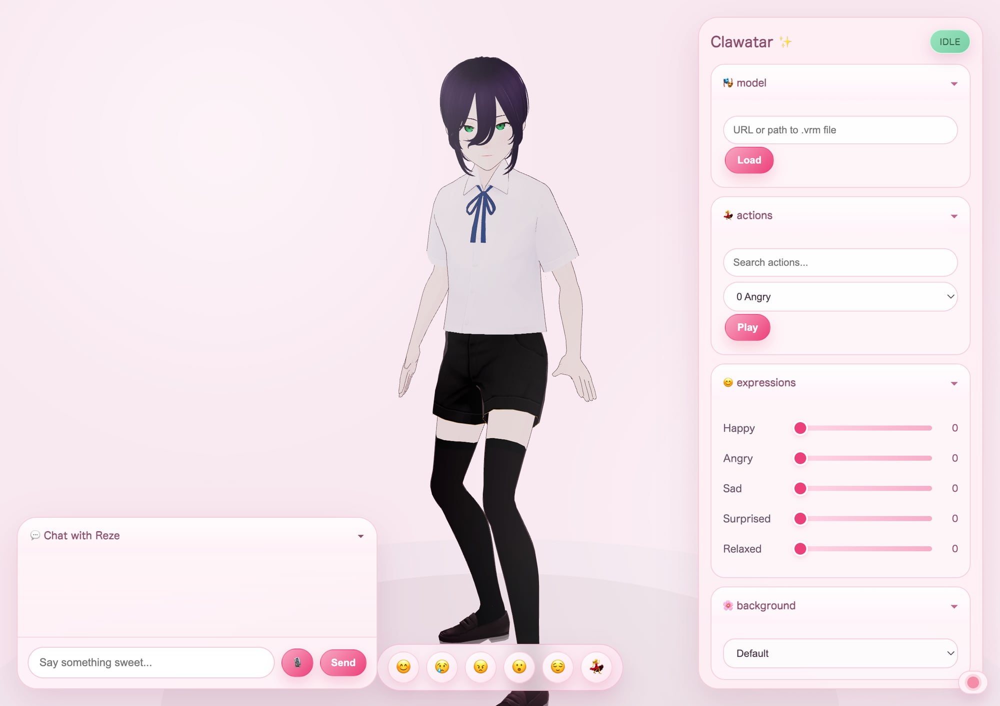
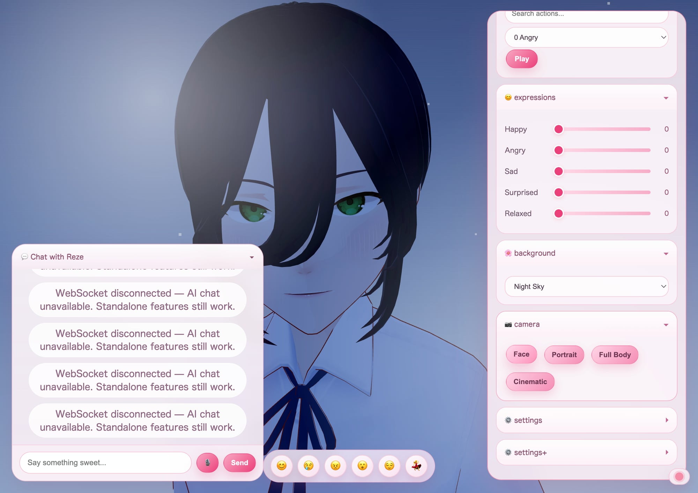
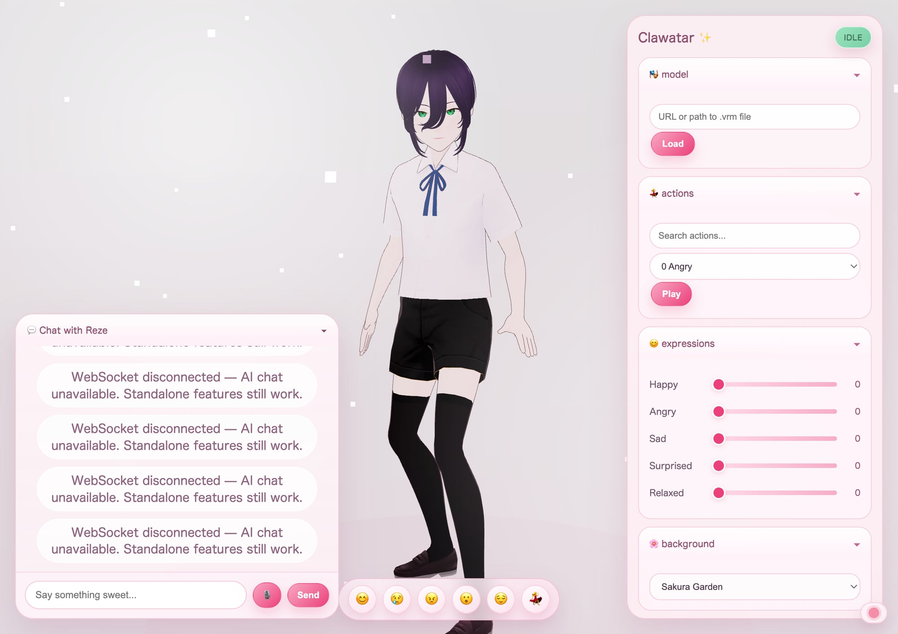
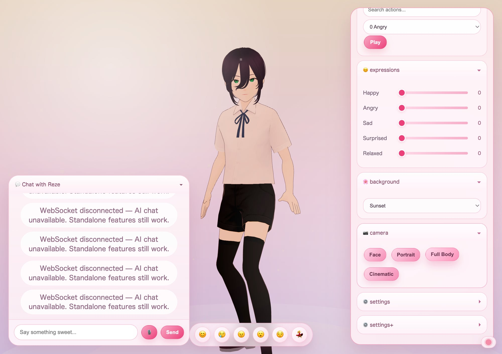

# Clawatar 🎭

**From Agent Intelligence to Interactive Intelligence. Give your AI agent a body.**

A web-based 3D VRM avatar viewer with real-time animations, voice chat, and lip sync — built for [OpenClaw](https://github.com/openclaw/openclaw).

## Screenshots

<p align="center">
  
  
</p>
<p align="center">
  
  
</p>

> *Cute sakura UI, multiple background scenes, camera presets, emotion bar, and 162 animations. VRM model not included — bring your own!*

## Quick Start

```bash
git clone https://github.com/Dongping-Chen/Clawatar.git
cd Clawatar
npm install
npm run start
```

Open `http://localhost:3000` and drop your `.vrm` model onto the page.

## Features

### 🎭 Avatar & Animation
- **162 animations** — wave, dance, think, laugh, shrug, and more (Mixamo VRMA)
- **Facial expressions** — happy, sad, angry, surprised, relaxed
- **Idle behavior** — avatar looks around, stretches, yawns when waiting
- **Touch reactions** — click the avatar for headpats, pokes, and silly reactions ✨

### 🌸 Beautiful UI
- **Sakura/anime theme** — cute pink glassmorphism panels
- **Background scenes** — Sakura Garden 🌸, Night Sky 🌙, Cozy Café ☕, Sunset 🌅
- **Camera presets** — Face, Portrait, Full Body, Cinematic with smooth transitions
- **Quick emotion bar** — 😊😢😠😮😌💃 one-tap expression + animation combos

### 🎤 Voice & Chat
- **Audio-driven lip sync** — mouth moves to actual speech audio
- **Voice input** — speak via your browser's microphone
- **Voice output** — ElevenLabs TTS (optional, requires API key)
- **AI conversation** — powered by [OpenClaw](https://github.com/openclaw/openclaw) (optional)

### 🏠 3D Room Environment
- **Procedural room** — desk, bed, bookshelf, fairy lights, 30+ objects
- **3 themes** — Cozy (warm afternoon), Study (desk lamp), Night (fairy lights + bloom)
- **Camera freedom** — orbit ±135° inside the room, walls fade on approach
- **Activity modes** — Study, Exercise, Chill with themed camera angles + animations

### 📹 Virtual Meeting Avatar
- **Join Google Meet / Zoom** — avatar appears via OBS Virtual Camera
- **Listen & respond** — captures meeting audio via BlackHole → Whisper STT → AI → TTS
- **Smart triggers** — responds when called by name or asked a question
- **Streaming pipeline (v3)** — VAD + streaming GPT-4o + streaming ElevenLabs TTS, ~2.6s latency
- **Rolling context** — maintains 2-minute transcript window for coherent responses

### 🔌 Developer-Friendly
- **WebSocket API** — control everything programmatically
- **Drag & drop** — load any VRM model
- **Standalone mode** — works without OpenClaw or ElevenLabs
- **OpenClaw skill** — install as an agent skill for AI-driven avatars

## Bring Your Own Model

No VRM model is bundled. You can:
1. **Drag & drop** a `.vrm` file onto the viewer
2. **Set a URL** in `clawatar.config.json` → `model.url`
3. **Enter a URL** in the Model panel in the UI

## Configuration

Edit `clawatar.config.json`:

```json
{
  "model": { "url": "", "autoLoad": true },
  "voice": {
    "elevenlabsVoiceId": "your-voice-id",
    "elevenlabsModel": "eleven_turbo_v2_5"
  },
  "server": { "vitePort": 3000, "wsPort": 8765, "audioPort": 8866 },
  "openclaw": { "gatewayPort": 18789, "sessionId": "vrm-chat" }
}
```

## WebSocket Protocol

```json
{"type": "play_action", "action_id": "161_Waving"}
{"type": "set_expression", "name": "happy", "weight": 0.8}
{"type": "speak", "text": "Hello!", "action_id": "161_Waving", "expression": "happy"}
{"type": "reset"}
```

## Architecture

```
Browser (localhost:3000)
├── Three.js + @pixiv/three-vrm
├── VRMA animation playback
├── Audio-driven lip sync
└── Chat UI + Emotion Bar
    │
    │ WebSocket (ws://localhost:8765)
    ▼
WS Server (server/ws-server.ts)
├── Command relay & routing
├── ElevenLabs TTS (optional)
└── OpenClaw agent bridge (optional)
```

## OpenClaw Skill

Clawatar includes an [OpenClaw](https://github.com/openclaw/openclaw) skill at `skill/SKILL.md`. Install it to let your AI agent control the avatar with animations, expressions, and voice.

## Scripts

| Command | Description |
|---------|-------------|
| `npm run start` | Start dev server + WebSocket server |
| `npm run dev` | Vite dev server only |
| `npm run ws-server` | WebSocket server only |
| `npm run build` | Production build |
| `npm run catalog` | Regenerate animation catalog |
| `npm run meeting` | Virtual meeting bridge v2 (continuous listen + smart trigger) |
| `npm run meeting:v3` | Virtual meeting bridge v3 (streaming VAD + streaming TTS) |

## Virtual Meeting Setup

1. Install [OBS Studio](https://obsproject.com/) and [BlackHole 2ch](https://existential.audio/blackhole/)
2. Create a Multi-Output Device (Audio MIDI Setup) → your speakers + BlackHole 2ch
3. Set system output to the Multi-Output Device
4. OBS: Add Browser Source → `http://localhost:3000?embed` → Start Virtual Camera
5. Start the avatar: `npm run start`
6. Start the meeting bridge: `npm run meeting:v3`
7. In Google Meet: select OBS Virtual Camera (video) and BlackHole 2ch (mic)

See `virtual-meeting/README.md` for detailed architecture docs.

## Credits

- **Animations:** [Mixamo](https://www.mixamo.com/) — non-commercial use, credit required
- **VRM rendering:** [@pixiv/three-vrm](https://github.com/pixiv/three-vrm)
- **Inspired by:** [moeru-ai/airi](https://github.com/moeru-ai/airi)

## License

MIT — see [LICENSE](LICENSE)
